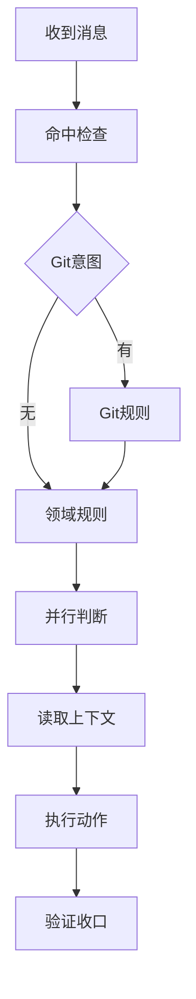

---
id: 20260706-232600-codex-agents-rules
type: knowledge
title: 仓库总规则
aliases:
  - AGENTS.md
  - 总规则
  - Codex仓库规则
  - skill强制触发规则
tags:
  - codex/rules
  - skill-flow
  - repository-policy
status: active
created: 2026-07-06
updated: 2026-07-08
source_sessions: []
source_refs:
  - F:/luode-skills/AGENTS.md
related: []
entities:
  - Codex
  - Obsidian
topics:
  - 仓库规则
  - skill自动触发
  - 本地执行约束
confidence: high
---

# 仓库总规则

> [!NOTE]
> 这篇笔记是从 `F:/luode-skills/AGENTS.md` 沉淀出的长期知识，只保存稳定规则、决策和流程，不复制完整原文，也不保存 secret、API key、token 或密码原值。

## 定义

`AGENTS.md` 是当前 skill 仓库的总规则入口，适用于本仓库下所有代码与文档变更。Codex 使用 `AGENTS.md`，Claude Code 使用 `CLAUDE.md`，两者内容规则相同。

## 适用范围

| 对象 | 当前口径 |
| --- | --- |
| 仓库 | `F:/luode-skills` |
| 规则源 | `F:/luode-skills/AGENTS.md` |
| 生效范围 | 本仓库所有代码、文档、配置、脚本和 skill 资产变更 |
| 最高优先级 | skill 自动触发、禁止未授权 Git 写历史、真实工具调用、UTF-8 写入、本地连接调试 |

## 操作规则

| 主题 | 长期规则 |
| --- | --- |
| Skill命中 | 每轮用户新消息必须先命中 `skill-hit-check-rules`，并主动扫描所有可用 skill 的触发条件。 |
| 基础skill | 处理本仓库任务至少命中 `skill-hit-check-rules`、`parallel-task-dispatch-rules`、`reasoning-summary-structure-rules`、`project-memory-rules`、`project-style-rules`。 |
| 并行判断 | 实质执行前必须判断是否可并行；单一裁决、同一写集或小型短链路任务串行优先。 |
| Git红线 | 当前轮没有明确提交或推送授权时，禁止 `commit`、`push`、`rebase`、`merge --no-ff` 等写历史动作。 |
| 长期上下文 | 会话开始和压缩续做后检测 `AGENTS.md`、`CLAUDE.md`、`PROJECT_MEMORY.md`、`PROJECT_STYLE.md`，存在即加载，缺失按模板创建。 |
| 编码 | Windows、Linux、WSL 写入代码、文档、配置和生成文本时统一 UTF-8，禁止依赖默认编码。 |
| 本地调试 | 测试、复现、运行、联调只能连接 local 环境，不得直接连 test、prod、staging、pre 或 release。 |
| Obsidian知识流 | 会话开始按需先检索历史知识；阶段收口时只沉淀可复用的稳定事实、决策、流程、定义和偏好。 |
| 输出 | 普通说明和总结使用 Markdown，不用 HTML 或无语言代码围栏包裹自然语言。 |
| 工具真实性 | 文件、命令、搜索、网络读取必须来自真实工具调用，禁止伪造调用结果。 |

## 执行流程

## 证据

- 来源文件：`F:/luode-skills/AGENTS.md`
- 文件大小：30234 bytes
- SHA256：`481E18A0D2E74B3AD1BE3C65880ADC796F2B4BB8A928B5D7E18F058C9AA9FEC6`
- 沉淀时间：2026-07-06
- 沉淀方式：通过 Obsidian CLI 写入 vault `知识库`。

## 关联

- [[20-Knowledge/codex-rules/Obsidian知识流自动触发链修复|Obsidian知识流自动触发链修复]]：Obsidian 自动触发链与旧目录误放修复的背景说明。
- [[Codex]]
- [[Obsidian]]
- [[skill-hit-check-rules]]
- [[parallel-task-dispatch-rules]]
- [[reasoning-summary-structure-rules]]

## Obsidian 固定映射

- 固定根目录：D:\obsidian_data
- 实际知识工作区：知识库/
- 使用 Obsidian skill 时，不再通过环境变量、.obsidian-kb-root 或其它候选路径重新推导 vault；只回答是否检索、沉淀、阻断。

## 关联项目

- [[20-Knowledge/codex-rules/luode-skills-仓库概览|luode-skills 仓库概览]]：当前仓库的项目入口与 Git / Obsidian 联动口径。
- 当前项目路径：`D:/luode/luode-skills`

## 路径说明

- 上述固定根目录口径以 D:\obsidian_data 为准，后续写法统一使用单个反斜杠。

