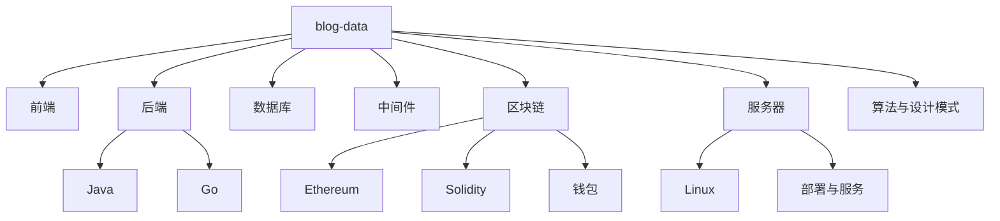

# blog-data 技术知识地图

> [!NOTE]
> 本地图把源 vault `F:/blog/data` 的 1110 篇 Markdown 按主题纳入当前知识库检索入口。它是第一层沉淀：先固化结构、主题和后续逐篇抽取边界。

## 入口

- 来源说明：[[50-Sources/vaults/blog-data-vault|F blog data Obsidian vault]]
- 源 vault：`data`
- 源路径：`F:/blog/data`
- 目标 vault：`D:/obsidian_data/知识库`

## 核心笔记

| 主题 | 源目录 | 数量 | 代表路径 |
| --- | --- | ---: | --- |
| 前端 | `1.前端` | 161 | `1.HTML`、`2.JavaScript`、`3.CSS`、`4.React`、`5.Vue` |
| 后端 | `2.后端` | 339 | `1.Java`、`2.Go`、`3.AI` |
| 数据库 | `3.数据库` | 81 | `1.MySQL关系型数据库`、`2.Nebula图数据库`、`3.Redis缓存数据库`、`4.MongoDB文档数据库` |
| 中间件 | `4.中间件` | 15 | `Apifox`、`Docker`、`Kafka` |
| 区块链 | `5.区块链` | 305 | `基础概念`、`Eth`、`Fabric`、`共识算法`、`钱包`、`事件合约` |
| 服务器 | `6.服务器` | 111 | `操作系统`、`Linux命令`、`部署基础`、`blog博客系统`、`内网组网` |
| 算法 | `7.算法` | 58 | 算法基础和题目沉淀 |
| 设计模式 | `8.设计模式` | 38 | 常见设计模式 |
| 版本控制 | `9.版本控制` | 2 | Git |

## 主题路线

## 检索提示

- 查前端：搜索 `前端`、`JavaScript`、`React`、`Vue`、`CSS`。
- 查后端：搜索 `Java`、`Go`、`Spring`、`JVM`、`并发`、`MyBatis`。
- 查数据库：搜索 `MySQL`、`Redis`、`MongoDB`、`Nebula`。
- 查区块链：搜索 `Ethereum`、`Solidity`、`Hardhat`、`Geth`、`Fabric`、`钱包`。
- 查服务器：搜索 `Linux`、`Docker`、`部署`、`frp`、`nacos`、`VPN`。

## 待整理

- [ ] 对高频主题逐篇抽取定义、流程、排障经验和代码模板。
- [ ] 对钱包、服务器、备份、VPN 等敏感主题先做脱敏策略，再决定是否沉淀正文。
- [ ] 为 Java、Go、Solidity、Linux 命令等大主题建立二级 MOC。